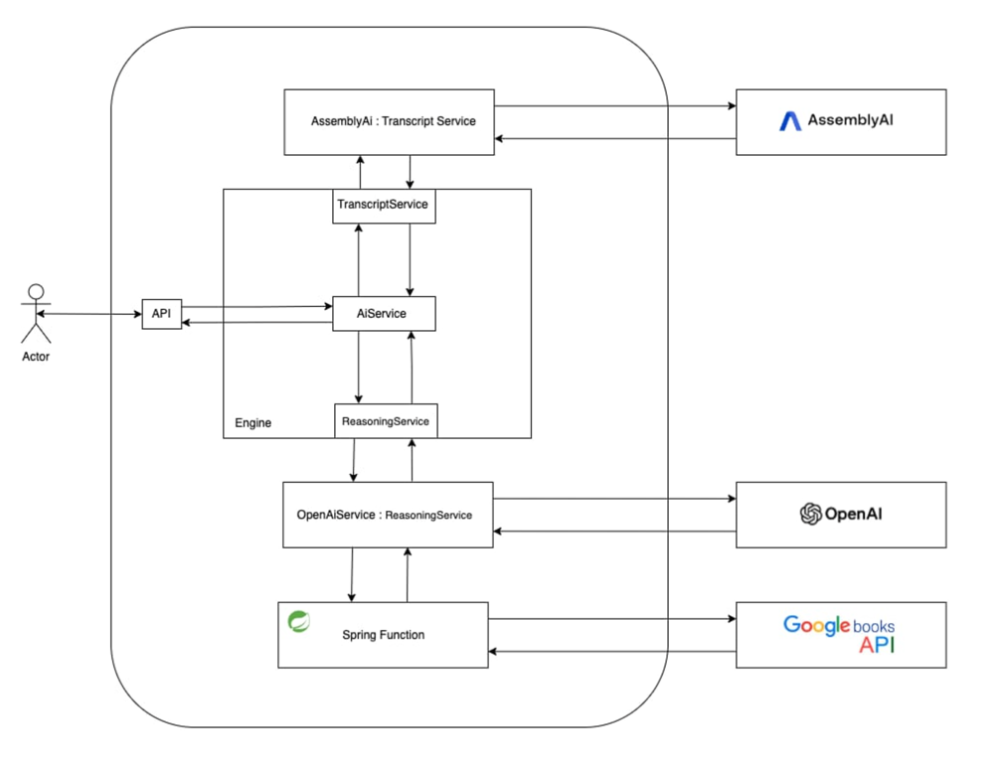

# Spring AI

This repository demonstrates how to integrate AI models, such as GPT-4, into a Spring Boot application, leveraging external data sources to enhance their functionality. The application highlights how to enrich prompts with real-time data using Google Books API and handle audio-based queries using AssemblyAI for transcription.

## Features

- **AI Integration with GPT-4**: Processes enriched prompts to generate intelligent and context-aware responses.
- **Audio Query Support**: Accepts audio files from users, transcribes them using AssemblyAI, and processes the query.
- **Prompt Enrichment**: Uses Google Books API to fetch the latest data, ensuring responses are up-to-date.
- **Scalable Architecture**: Built with Spring Boot, incorporating Spring Functions for modularity and reusability.
- **Flexible Design**: Abstracted services (`TranscriptService`, `ReasoningService`) ensure easy adaptability to other AI or transcription providers.

## Architecture Overview

1. **Audio Input**: Users submit an audio file containing their query.
2. **Transcription**: `TranscriptService` uses AssemblyAI to convert audio to text.
3. **Prompt Enrichment**: `fetchBooks` function fetches the latest book data from Google Books API.
4. **AI Response**: `ReasoningService` processes the enriched prompt using GPT-4 and generates a response.

## Technologies Used

- **Spring Boot**: Backend framework for building scalable applications.
- **Spring Functions**: Lightweight, reusable functions for focused tasks.
- **Google Books API**: Provides up-to-date book information.
- **AssemblyAI**: Handles audio transcription.
- **GPT-4**: Generates intelligent responses based on enriched prompts.

## Installation

1. Clone the repository:
   ```bash
   git clone https://github.com/BartDro/SpringAi.git
   cd SpringAi
   ```

2. Configure API keys in `application.yaml` file:
   - Add OpenAi API key.
   - Add AssemblyAI API key.
   - Add Google Books API key.


3. Build and run the application:
   ```bash
   ./gradlew bootRun
   ```

## Usage

1. Send http request with audio prompt to the designated endpoint.

### Example Request

**Endpoint:**  
`POST http://localhost:8080/ai-api/audio/prompt`  

**Headers:**  
```
Content-Type: multipart/form-data; boundary=boundary
```

**Payload:**  
```
--boundary
Content-Disposition: form-data; name="audio"; filename="sciFiBooksPrompt.mp3"
Content-Type: audio/mpeg

< scifiBooksPrompt.mp3
--boundary
```

**Response Example:**  
```
Here are some recent science fiction books that have been published this year:

1. **Landfall by James Bradley**
   - **Description:** Set in a waterlogged Sydney facing the threat of climate change, a police officer must navigate corruption and danger to rescue a missing girl. This book reflects on what it means to be human on a global scale.
   - [More Info](https://books.google.com/books/about/Landfall.html?id=Cq0PEQAAQBAJ)

2. **Some Body Like Me by Lucy Lapinska**
   - **Description:** In a world unraveling, Abigail, a replacement for a deceased woman, faces questions about her identity and desires as she anticipates newfound freedom. This novel explores boundaries of sexuality and love at the end of the world.
   - [More Info](https://books.google.com/books/about/Some_Body_Like_Me.html?id=Y1PiEAAAQBAJ)

3. **Horror on the Brain: The Neuroscience Behind Science Fiction by Austin Lim**
   - **Description:** This book explores the intersection of neuroscience and speculative fiction, recounting bizarre real-life cases alongside fiction that stretches scientific boundaries.
   - [More Info](https://books.google.com/books/about/Horror_on_the_Brain.html?id=xuTJ0AEACAAJ)

4. **BattleTech: A Night in the Woods by Michael A. Stackpole**
   - **Description:** A mercenary commander must create a ’Mech unit for a reenactment while dealing with wealthy backers and rivalries, leading to unexpected outcomes in a historic recreation.
   - [More Info](https://play.google.com/store/books/details?id=UnA1EQAAQBAJ)

5. **Threads of Time by Cindy Monica**
   - **Description:** In a future where time travel is regulated, a young engineer and his friend discover a time anomaly and must stop a rogue traveler from altering history.
   - [More Info](https://play.google.com/store/books/details?id=qLovEQAAQBAJ)

These books present diverse themes and narratives, from climate fiction to explorations of identity and time travel. Enjoy your journey through these new worlds!
```
